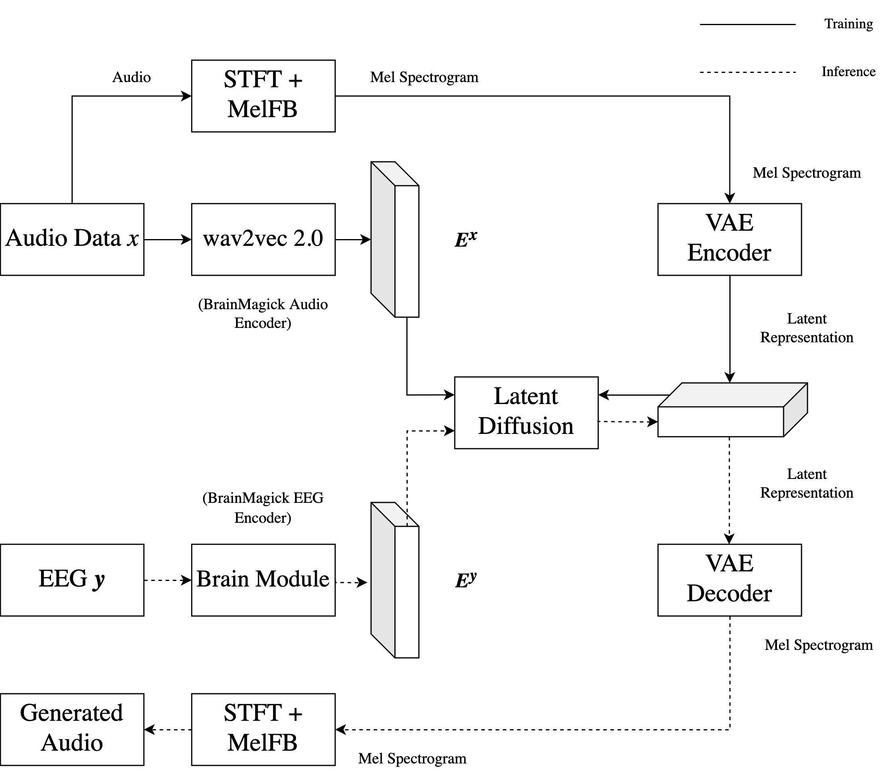

# Conditional Difussion models for audio generation: from EEG to Speech

## Repositorios del proyecto

El proyecto cuenta con varios forks de los repositorios de los proyectos base utilizados en el estudio.

- [BrainMagick](https://github.com/inogii/brainmagick)

- [Brennan2019](https://www.kaggle.com/datasets/inogii/brennan) (dataset para brainmagick)

- [Dora - bugfixes](https://github.com/inogii/dora)
- [Flashy - bugfixes](https://github.com/inogii/flashy)

- [AudioLDM](https://github.com/inogii/AudioLDM-training-finetuning)

## Introducción

Los sistemas de generación de audio basados en señales de EEG han emergido como una prometedora área de investigación debido a su capacidad para sintetizar audio a partir de señales cerebrales. Estos sistemas tienen aplicaciones en la comunicación asistida, la generación de habla para personas con discapacidades motoras y la interfaz cerebro-computadora, entre otros. Sin embargo, la generación de audio a partir de señales de EEG es un problema complejo que requiere la integración de técnicas de procesamiento de señales, aprendizaje profundo y neurociencia.

En este estudio, proponemos un sistema denominado EEG2Speech, un modelo de generación de habla condicionado a una señal de EEG. Para ello, se propone utilizar una arquitectura basada en un modelo de difusión latente de generación de audio condicionado a señales de EEG. Los modelos de difusión latente son una variante avanzada de los modelos de difusión que trabajan con representaciones latentes de los datos en lugar de con los datos originales. Esta representación latente es una forma comprimida de los datos originales que captura las características esenciales de los mismos, lo que permite una generación de muestras más eficiente computacionalmente.

El modelo EEG2Speech se basa en la arquitectura de [AudioLDM](https://audioldm.github.io/), un sistema de generación de texto a audio que utiliza Modelos de Difusión Latente (LDM). AudioLDM se basa en el modelo de preentrenamiento contrastivo CLAP, que entrena un encoder de Audio y otro de Texto para que los embeddings de texto y audio de una misma pareja sean lo más similares posibles y los de parejas distintas sean lo más diferentes posibles. Durante la fase de entrenamiento, AudioLDM se condiciona únicamente con embeddings de audio para aprender a hacer denoising de las representaciones latentes de las señales de audio. Sin embargo, durante la inferencia, el modelo puede ser condicionado con embeddings de texto para guiar la generación de audio.

En el caso de EEG2Speech, se propone sustituir la pareja de encoders de Audio y Texto de CLAP por una pareja de encoders de EEG y Audio obtenida del proyecto [brainmagick](https://github.com/facebookresearch/brainmagick). Una vez modificada la arquitectura, se reentrena el modelo con el dataset empleado para el entrenamiento de brainmagick (brennan2019), y se evalúa su rendimiento en la generación de audio condicionado a señales de EEG.

### Arquitectura propuesta

## Objetivos

- [x] Entrenar y extraer el encoder de EEG de BrainMagick (brennan2019).
- [ ] Extraer el encoder de audio de wav2vec 2.0.
- [ ] Extraer el dataset procesado de BrainMagick (brennan2019).
- [ ] Inferir embeddings de EEG y audio para el dataset de BrainMagick. 
- [ ] Modificar la arquitectura de AudioLDM para incluir el encoder de EEG en lugar del encoder de texto.
- [ ] Modificar la arquitectura de AudioLDM para incluir el encoder de wav2vec 2.0 en lugar del encoder de audio.
- [ ] Reentrenar el modelo con el dataset brennan2019.

## Trabajo Previo

### [AudioLDM](https://audioldm.github.io/)

AudioLDM es un sistema de generación de texto a audio que utiliza Modelos de Difusión Latente (LDM). El uso de difusión latente frente a difusión tradicional hace que el sistema sea computacionalmente más eficiente y escalable, ya que genera representaciones latentes de audio (dimensionalmente más pequeñas que el audio en sí) que luego se decodifican en señales de audio. 

El sistema utiliza embeddings de texto y audio para condicionar al LDM durante la generación de audio. Estos embeddings son generados a través de un modelo de preentrenamiento contrastivo denominado Contrastive Language-Audio Pre-training (CLAP). El objetivo de CLAP es entrenar un encoder de Audio y otro de Texto para que los embeddings de texto y audio de una misma pareja sean lo más similares posibles y los de parejas distintas sean lo más diferentes posibles. Esto permite que los embeddings sean intercambiables, pudiendo utilizar embeddings de audio para el entrenamiento del LDM y embeddings de texto para la inferencia.

Durante la fase de entrenamiento, AudioLDM se condiciona únicamente con embeddings de audio para aprender a hacer denoising de las representaciones latentes de las señales de audio. Sin embargo, durante la inferencia, el modelo puede ser condicionado con embeddings de texto para guiar la generación de audio. Esto se debe a que los embeddings de texto y audio comparten propiedades semánticas en el espacio latente aprendido, lo que permite al modelo utilizar la información textual para generar audio fiel a la descripción proporcionada. 

### [BrainMagick](https://github.com/facebookresearch/brainmagick)

El "brain module" en el proyecto BrainMagick es un encoder que procesa señales cerebrales captadas mediante M/EEG (magneto/electroencefalografía) para decodificar el habla. Este módulo utiliza una arquitectura de red neuronal convolucional profunda, equipada con capas de atención espacial que enfocan el análisis en las regiones cerebrales más relevantes y una capa específica por sujeto para adaptar el aprendizaje a las variaciones individuales.

El aprendizaje del modelo se basa en técnicas de contrastive learning, que busca que los embeddings de audio y de M/EEG sean lo más similares posibles para una misma pareja y lo más diferentes posibles para parejas distintas. Como encoder de audio, se utiliza wav2vec 2.0, un encoder preentrenado en tareas de reconocimiento de voz que genera embeddings de audio a partir de señales de audio.
